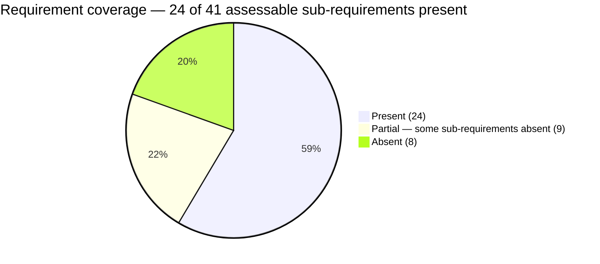
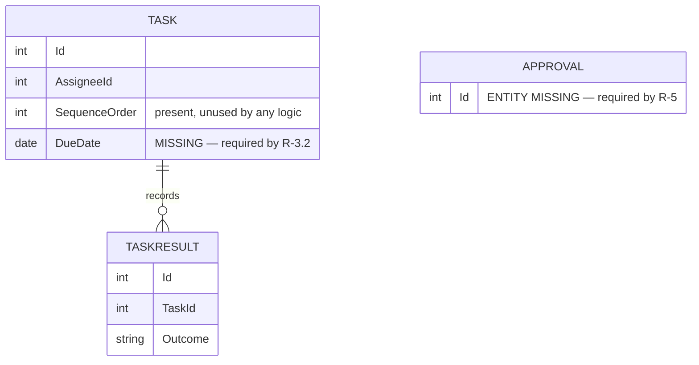
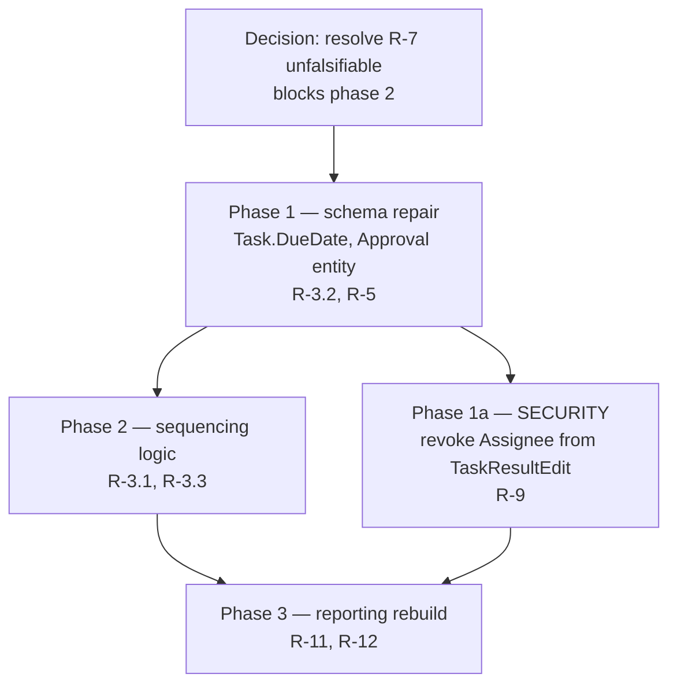

# Coverage figures and the three diagrams

From `../../../CONVENTIONS.md`, heading "A coverage figure must state its denominator":
a bare percentage is a judgement wearing the costume of a measurement.

## Rules for every number in the report

- **Denominator always, first.** "3 of 5 named sub-requirements present (60%)". Never
  the percentage alone, not even in a chart label or an executive summary.
- **Reproducibility test.** Two reviewers with the same itemised evidence must land on
  the same number. If they would not, the sub-requirements are not named concretely
  enough — fix the row, not the number.
- **Count named sub-requirements, never weight by importance.** Weighting is a judgement
  that cannot be recomputed. Importance belongs in the remediation sequence, where it is
  argued explicitly, not smuggled into a coefficient.
- **Aggregate by arithmetic, shown.** The app-level figure is the sum of present
  sub-requirements over the sum of assessable sub-requirements, and the report prints
  both totals. Never estimate an aggregate independently of the rows — an aggregate that
  does not equal its rows is a fabrication, and it is the single easiest thing for a
  reader to catch.
- **Three categories of row leave the denominator**: unfalsifiable requirements,
  unresolved-by-inventory rows, and withdrawn identifiers. Each is reported as its own
  count next to the aggregate, so the reader can see the denominator was reduced and by
  how much.
- **Security findings are never averaged in.** Own section, own count.
- **Never report a trend without recomputing both ends.** A prior report's number is not
  a baseline unless its rows were re-derived.

## Diagram 1 — requirement coverage

Done vs partial vs absent, with counts labelled — the label carries the number, so the
chart is readable without measuring bars.

Add, as a caption not a slice: unfalsifiable `<n>`, unresolved by inventory `<n>`, both
excluded from the 41. A slice for them would imply they were assessed.

Use a bar chart instead when reporting per-area coverage, which is usually more
actionable than one app-level figure:

The counts are the aggregate of the per-area rows, so the chart is recomputable
from the matrix rather than drawn by eye.

Per-area detail goes in a table beside it, not a second chart — a reader
comparing four areas wants the numbers, and a table cannot fail to render:

| Area | Present | Assessable | Coverage |
|---|---|---|---|
| Intake | 8 | 9 | 89% |
| Scheduling | 3 | 11 | 27% |
| Results | 1 | 7 | 14% |
| Reporting | 0 | 4 | 0% |

**Stick to `pie`, `erDiagram`, `flowchart` and `graph`.** Newer mermaid chart
types (`xychart`, and anything still carrying a `-beta` suffix) are not
supported by every renderer, and a report whose chart renders as an error block
is worse than one with a table. If you want a grouped bar chart, confirm the
renderer handles it before relying on it, and keep the table as the fallback.

## Diagram 2 — actual schema against required schema

The point is to make **absences visible as absences** rather than described in prose.
Draw one ER diagram containing both, and mark every element that does not exist.

Conventions to keep consistent, because a reader will not guess them:

- `MISSING — required by <ID>` on any absent attribute, and on the first attribute of an
  absent entity, with the entity marked `ENTITY MISSING`.
- Present-but-unused elements annotated as such — that is the "schema present, logic
  absent" shape made visible.
- Every annotation names the requirement identifier, so the diagram and the matrix are
  navigable in both directions.
- Split into per-area diagrams past roughly a dozen entities; an unreadable diagram is
  not a deliverable.

## Diagram 3 — phased remediation

The sequence from `repair-vs-rebuild.md`, with dependencies visible, so a team can plan
against it. This is the diagram a real team used to plan. `[SINGLE-OBSERVATION]`

Rules: every node names the requirement identifiers it closes; security work is drawn as
its own node and never buried inside a phase; a decision node precedes anything blocked
by an unfalsifiable requirement; and the graph must be acyclic — a cycle means the
sequencing is not decided yet.

## When no renderer is available

Emit the mermaid source in the report anyway, fenced. The source is the deliverable; a
rendered image is a convenience. Never substitute a prose paragraph for a required
diagram.
